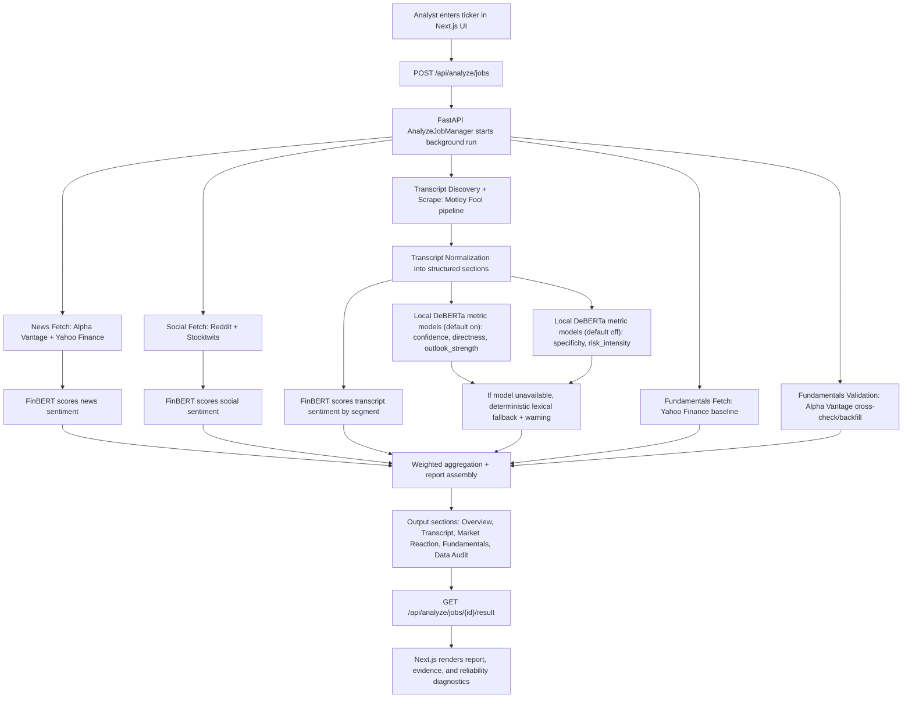

# Process Diagram

## Operating interpretation

This process replaces a multi-tab manual workflow with one repeatable run that is easier to scale and easier to review. The diagram explicitly shows where each signal is sourced and how scoring combines FinBERT sentiment with local DeBERTa communication metrics.

## Default metric behavior (current implementation)

- `On by default`: confidence, directness, outlook strength.
- `Off by default`: specificity, risk intensity.
- All five local model paths are DeBERTa-based artifacts under `output/student_models/...`.
- Missing/failed local models degrade to deterministic fallback behavior with surfaced warnings.

## Citations

- `app/page.tsx:81`
- `finbert_site/main.py:434`
- `finbert_site/jobs.py:98`
- `finbert_site/analysis.py:1700`
- `finbert_site/analysis.py:1718`
- `finbert_site/analysis.py:1776`
- `finbert_site/analysis.py:1789`
- `finbert_site/analysis.py:1833`
- `finbert_site/analysis.py:1738`
- `finbert_site/analysis.py:1750`
- `finbert_site/analysis.py:1676`
- `finbert_site/settings.py:66`
- `finbert_site/settings.py:69`
- `finbert_site/settings.py:84`
- `finbert_site/settings.py:88`
- `finbert_site/settings.py:92`
- `finbert_site/settings.py:96`
- `finbert_site/settings.py:100`
- `README.md:86`
- `finbert_site/schemas.py:413`
