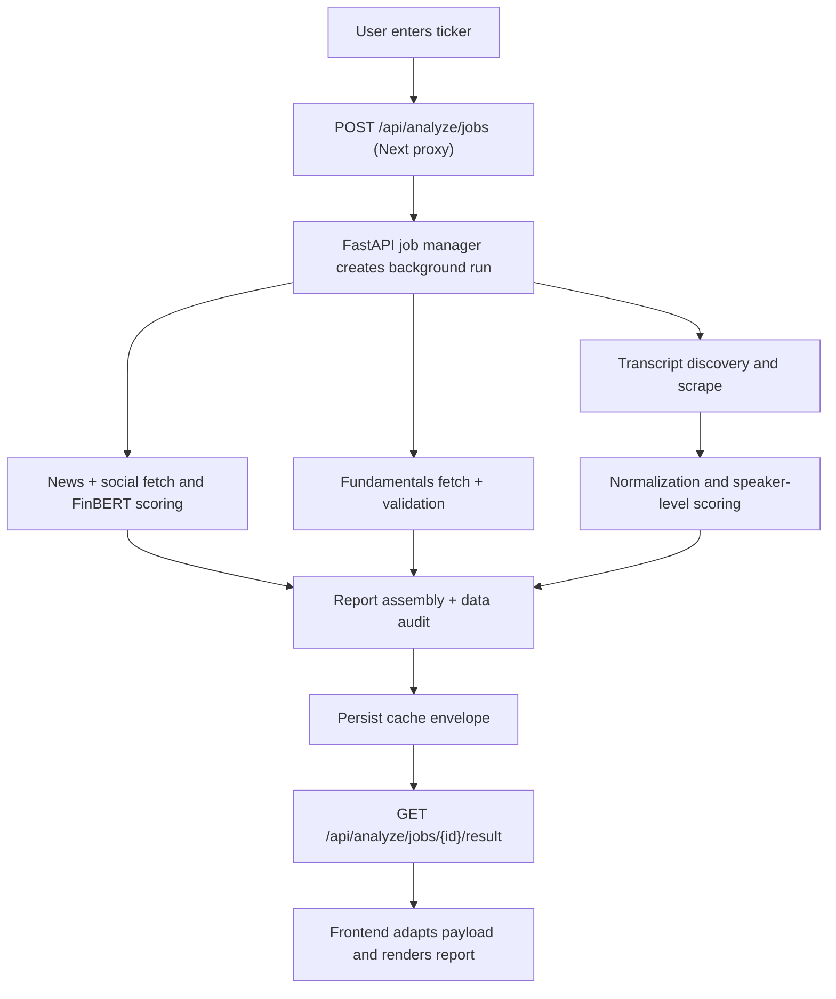

# Process Diagram

## Citations

- `lib/finbert/client.ts:39`
- `finbert_site/main.py:434`
- `finbert_site/jobs.py:208`
- `finbert_site/progress.py:15`
- `finbert_site/analysis.py:1676`
- `finbert_site/main.py:455`
- `lib/finbert/adapters.ts:289`
