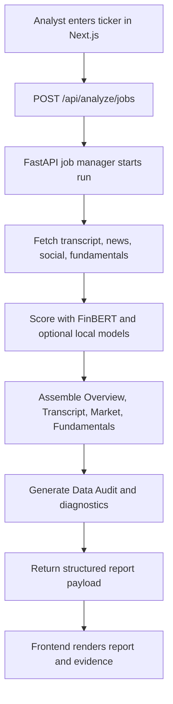

# Process Diagram

## Operating interpretation

This process replaces a multi-tab manual workflow with one repeatable run that is easier to scale and easier to review.

## Citations

- `app/page.tsx:81`
- `finbert_site/main.py:434`
- `finbert_site/jobs.py:98`
- `finbert_site/analysis.py:1676`
- `finbert_site/schemas.py:413`
